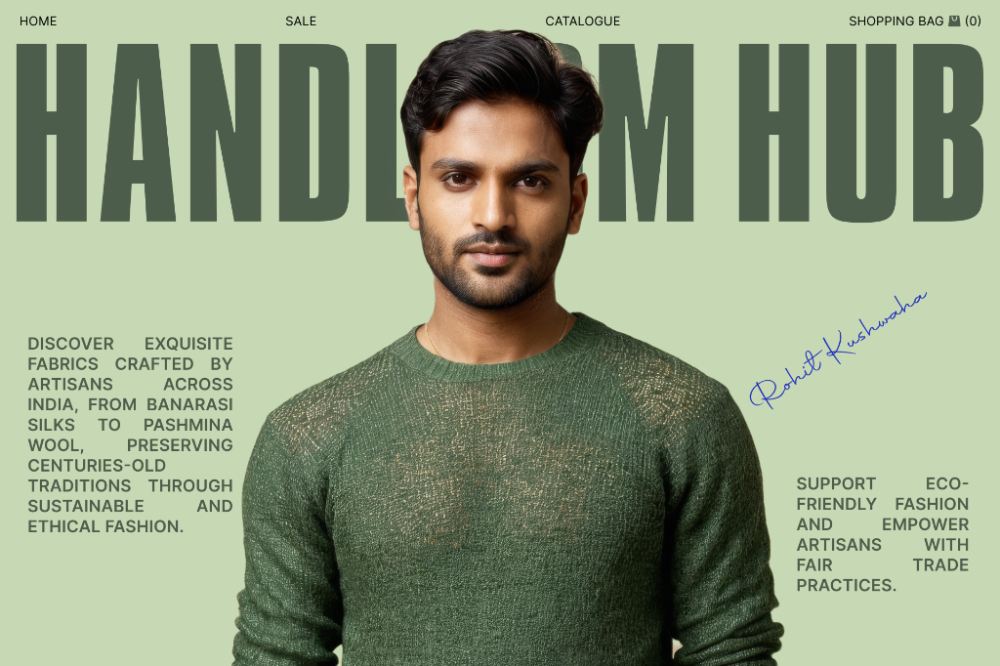

# Rohit — Developer & UI/UX Portfolio

An ultra-sleek, minimalist personal portfolio website built with **Next.js 16 (App Router)**, **Tailwind CSS v4**, **Framer Motion**, and **TypeScript**. Designed with a developer-centric blueprint aesthetic featuring dashed grid lines, stark monochrome contrast, category filtering, and direct links to live web applications and Behance case studies.



---

## ✨ Features

- 🎨 **Minimalist Blueprint Design**: Stark dark/light monochrome base (`#0F0E0E`), dashed grid guides, crisp typography (`Instrument Serif`, `Inter`, `JetBrains Mono`).
- 🌗 **Persistent Dark / Light Mode**: Instant theme switcher synced with `localStorage` and system preferences without hydration flickering.
- 🗂️ **Interactive Project Showcase**:
  - **All (11)**: Complete overview of projects.
  - **UI/UX (5)**: Case studies linked directly to individual Behance gallery pages (*Handloom Hub, Community Clean-Up Drive, Delicious Eats, Smart Banking, Nike Redesign*).
  - **Frontend (6)**: Live production web applications (*PhysioCare, StepUp Rehabilitation, L’Étoile Haute Cuisine, Kamra Dental Care, Gym Town Fitness, ExamGaze*).
- ⚡ **Animations & Micro-interactions**: Smooth scroll-triggered fade-ins and character-by-character role text reveal using **Framer Motion**.
- 📱 **Fully Responsive**: Optimized for ultra-wide monitors down to small mobile devices.
- 🚀 **SEO & Performance**: OpenGraph metadata, structured JSON-LD schemas, and pre-rendered static routes.

---

## 🛠️ Tech Stack

- **Framework**: [Next.js 16 (App Router)](https://nextjs.org/)
- **Library**: [React 19](https://react.dev/)
- **Styling**: [Tailwind CSS v4](https://tailwindcss.com/)
- **Animations**: [Framer Motion](https://motion.dev/)
- **Icons**: [Lucide React](https://lucide.dev/) & Custom SVG Brand Icons
- **Language**: [TypeScript](https://www.typescriptlang.org/)
- **Deployment**: [Vercel](https://vercel.com/)

---

## 📂 Project Structure

```text
Portfolio/
├── public/
│   ├── behance/       # Extracted Behance case study cover graphics
│   └── projects/      # Live web application screenshots
├── src/
│   ├── app/
│   │   ├── globals.css # Core design system, theme variables & animations
│   │   ├── layout.tsx  # Root layout, Google fonts & theme initializer
│   │   └── page.tsx    # Main portfolio page assembly
│   ├── components/
│   │   ├── Header.tsx        # Navbar with logo, links, and ThemeToggle
│   │   ├── ThemeToggle.tsx   # Client-side light/dark mode button
│   │   ├── HeroBanner.tsx    # Cover banner, avatar & animated role reveal
│   │   ├── AboutSection.tsx  # Bio & key highlights
│   │   ├── ContactGrid.tsx   # 5-column social link grid
│   │   ├── Projects.tsx      # Category tabs (All, UI/UX, Frontend) & project cards
│   │   ├── TechStackSection.tsx # Filterable skill badges
│   │   ├── Footer.tsx        # Dashed-border footer
│   │   └── Icons.tsx         # Brand icons (GitHub, LinkedIn, Twitter, Mail)
│   └── data/
│       └── portfolio.ts      # Profile info, projects list & tech stack data
├── next.config.ts            # Next.js configuration & image remote patterns
├── package.json
└── README.md
```

---

## 🚀 Getting Started

### Prerequisites

Ensure you have **Node.js 18+** and **npm** installed.

### Installation

1. Clone the repository:
   ```bash
   git clone https://github.com/Rohitkhb7/Portfolio.git
   cd Portfolio
   ```

2. Install dependencies:
   ```bash
   npm install
   ```

3. Run the development server:
   ```bash
   npm run dev
   ```

4. Open [http://localhost:3000](http://localhost:3000) in your browser to view the portfolio.

---

## 📦 Building for Production

To create an optimized production build:

```bash
npm run build
```

To start the production server:

```bash
npm run start
```

---

## 🌐 Social & Profile Links

- **GitHub**: [https://github.com/Rohitkhb7](https://github.com/Rohitkhb7)
- **LinkedIn**: [https://www.linkedin.com/in/rohitkhb7/](https://www.linkedin.com/in/rohitkhb7/)
- **Twitter / X**: [https://x.com/Rohitkhb7](https://x.com/Rohitkhb7)
- **Behance**: [https://www.behance.net/Rohitkhb7](https://www.behance.net/Rohitkhb7)
- **Email**: [rohitkhb7@gmail.com](mailto:rohitkhb7@gmail.com)

---

## 📝 License

This project is open source and available under the [MIT License](LICENSE).
